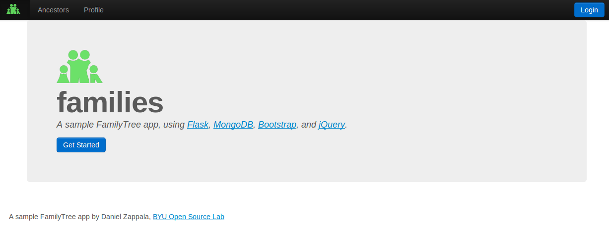
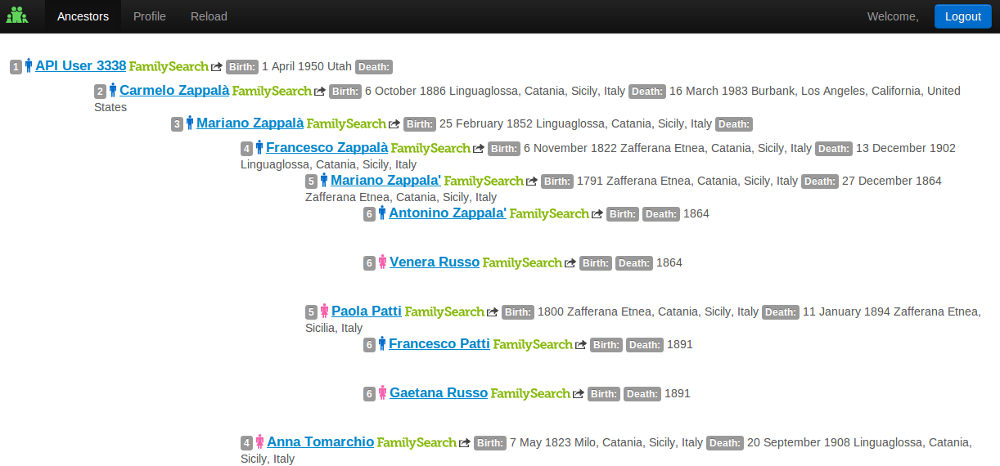
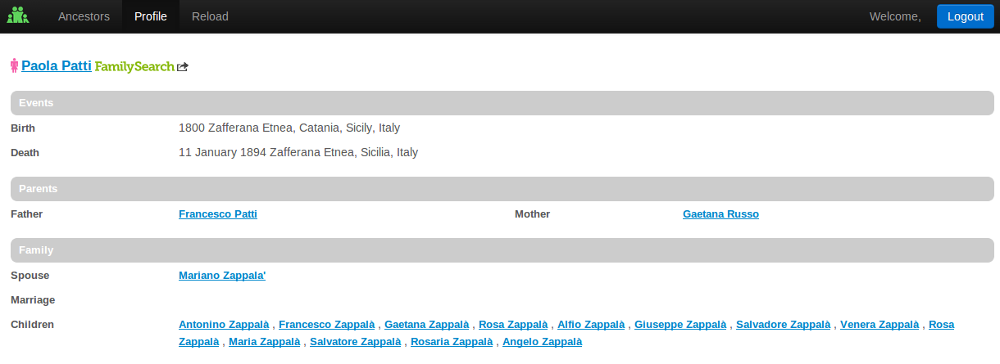

FamilyTree Sample Application
=============================

A sample FamilyTree application that uses Flask, MongoDB, Bootstrap, and jQuery. The
application displays a text-based pedigree, with names that can be clicked to provide a profile view.
To use this application, you need to have an access key for the FamilyTree API, details available from
FamilySearch at http://familysearch.org/developers.

Configuration
=============

Copy the doc/config-sample.py file to the top directory of the sample application. Edit this file
to enter your sandbox and production keys, obtained from FamilySearch. Set the sandbox variable to True
to use the sandbox key and False to use the production key.

If you want to try the application out on a production server, set the ADMINS variable to include
your email address, then also put the email address and password of a Gmail account into the emailAddress
and emailPassword variables. This will email you reports if a bug occurs when the application runs
on a production server.

To run on a production server, copy the doc/sample.wsgi file to the top directory of the sample application.
Edit this file to enter the path to where your code is stored. Then create a virtual host for Apache
that includes the following:

    <Virtualhost *:80>
        ServerName app.com

        WSGIDaemonProcess app user=www-data group=www-data home=/home/app/ processes=5 maximum-requests=1000
        WSGIScriptAlias / /home/app/familytree-sample-app/app.wsgi

        <Directory /home/app/familytree-sample-app>
                WSGIProcessGroup beta
                WSGIApplicationGroup %{GLOBAL}
                Order allow,deny
                Allow from all
        </Directory>            

        ErrorLog /var/log/apache2/app-error.log
        CustomLog /var/log/apache2/app-access.log combined

    </VirtualHost>

Replace the appropriate lines (ServerName, process name, directories, etc) with the actual values for your
server.

Screenshots
===========

The home page:

Click the **Getting Started** or the **Login** button to login via
FamilySearch. Once you login, you should see your ancsetry page:

By clicking on any name you can bring up the profile page for that
person:

All data is cached in a Mongo database. Per FamilySearch policy,
living people are stored in a separate database and NOT shared among
other users. Deceased people are stored in their own database and may
be shared among other users.  The **Refresh** button will refresh the
ancestry or profile views, by requesting the data again from
FamilySearch and replacing the cache in MongoDB.

Copyright
=========
Copyright 2013, Daniel Zappala

License
=======

This program is free software: you can redistribute it and/or modify
it under the terms of the GNU General Public License as published by
the Free Software Foundation, either version 3 of the License, or
(at your option) any later version.

This program is distributed in the hope that it will be useful,
but WITHOUT ANY WARRANTY; without even the implied warranty of
MERCHANTABILITY or FITNESS FOR A PARTICULAR PURPOSE.  See the
GNU General Public License for more details.

You should have received a copy of the GNU General Public License
along with this program.  If not, see <http://www.gnu.org/licenses/>.
